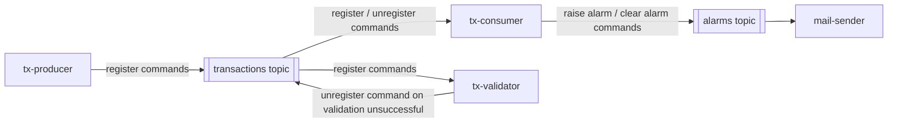
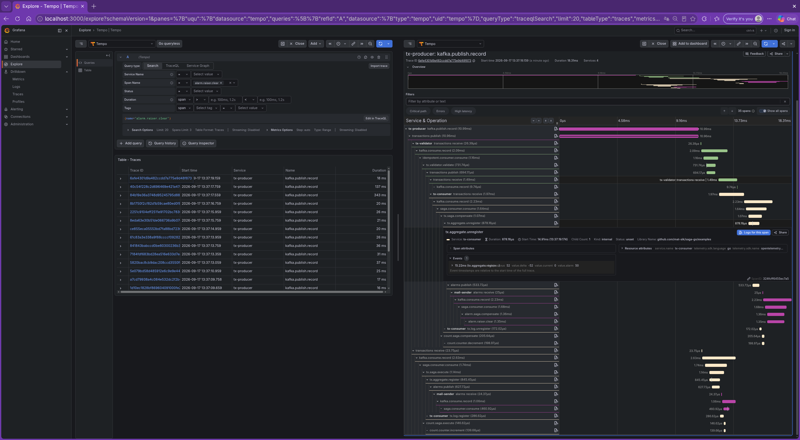
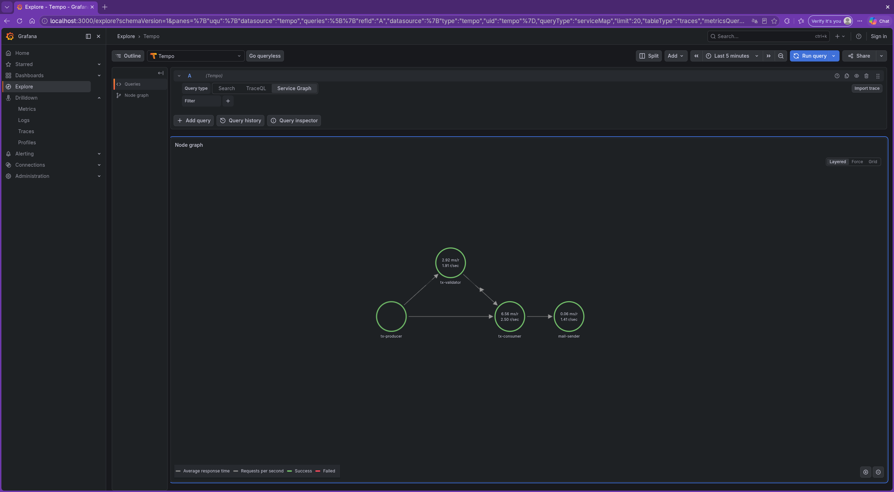

# saga-go

[](https://github.com/mat-sik/saga-go/actions)
[](https://github.com/mat-sik/saga-go/blob/main/LICENSE)

An example event-driven system implementing a **choreography-based Saga** (not orchestrated) for distributed
transaction processing, plus the reusable Kafka consumer libraries it's built on. OpenTelemetry tracing runs
through the full saga flow, and the example app can be deployed via Docker Compose or Kubernetes (Helm charts,
PostgreSQL and Kafka operators).

## Table of Contents

- [Overview](#overview)
- [Library Packages](#library-packages)
- [Architecture](#architecture)
    - [tx-producer](#tx-producer)
    - [tx-consumer](#tx-consumer)
    - [tx-validator](#tx-validator)
    - [mail-sender](#mail-sender)
- [Saga Flow](#saga-flow)
- [Testing](#testing)
- [Tech Stack](#tech-stack)
- [Observability](#observability)
- [Configuration](#configuration)
- [Deployment](#deployment)
    - [Docker Compose](#docker-compose)
    - [Kubernetes](#kubernetes)
- [License](#license)

## Overview

The example app registers and validates financial transactions, aggregated per player, date, and currency. When
an aggregate exceeds a configured limit, an alarm is raised and an email is sent; if the triggering transaction
is later compensated, the alarm is cleared and a follow-up email is sent. Unsuccessful validation triggers the
saga's compensating flow, unwinding the transaction.

## Library Packages

Three standalone packages. Only `kgoconsumer` is Kafka-specific; `idempotent` and `saga` are transport-agnostic (generic
over the message type) and don't depend on `kgoconsumer` at all - in the example app they're wired to
it by passing a `kgoconsumer.RecordConsumer` function that delegates into an `idempotent.Consumer` or
`saga.Consumer`, but either could just as easily wrap a different message source.

- **`kgoconsumer`** - a Kafka consumer built on [franz-go](https://github.com/twmb/franz-go). Polls records and
  retries a record on transient errors (`ErrTransient`) with backoff for a configurable duration; any other
  error is treated as permanent and the record is published to a DLQ topic straight away. Handles partition
  rebalances gracefully - in-flight processing is cancelled when a rebalance blocks, and a cancelled batch is
  correctly refetched afterward rather than lost or reprocessed out of order.
- **`idempotent`** - a generic idempotent consumer (`Consumer[T]`). Before running its consumer functions on a
  message, it asks a `PortOut` whether that message was already handled; if not, it runs them and then marks
  the message as handled. Has no Kafka dependency - `T` and the `PortOut` implementation are supplied by the
  caller.
- **`saga`** - a generic saga consumer (`Consumer[T, CT]`) built around the same already-handled check as
  `idempotent`, plus one more: for a compensating command it looks up whether the transaction it targets has
  already been compensated, so a compensating command that arrives before the original transaction is still
  handled correctly instead of being silently missed. Runs a configurable list of `Action[T, CT]`s (each with
  `Execute` and `Compensate`) against the resolved transaction or compensating transaction.

## Architecture

The project is composed of four components:



### tx-producer

Component that is responsible for generating a configurable stream of commands triggering transaction
registration.

### tx-consumer

Component that is responsible for processing transactions. It aggregates transactions by player, date and
currency. Stores log records of each transaction. Raises or clears alarm by publishing alarm commands to the
alarms topic when the aggregated value limit is exceeded. On a compensating transaction, the value of the
transaction is subtracted from the aggregate. If an alarm-raising command has been published, an alarm-clearing
command will be published. Uses the `saga` consumer.

### tx-validator

Component that consumes the same registration transactions as tx-consumer and validates them. When validation
is unsuccessful, an unregister command is issued, which acts as the compensating transaction that starts the
compensation flow of the saga. Uses the `idempotent` consumer.

### mail-sender

Component that sends e-mails for alarm commands. If some transaction caused the aggregated value limit to be
exceeded, an e-mail describing the limit exceeding will be sent. If later the same transaction is compensated,
an e-mail regarding clearing the alarm will be sent. Uses the `saga` consumer.

Both the `register`/`unregister` commands and the `raise`/`clear` alarm commands share a single topic each
(transactions, alarms), and every topic has a corresponding DLQ topic.

## Saga Flow

1. `tx-producer` emits a registration command.
2. `tx-consumer` aggregates the transaction and evaluates the limit; `tx-validator` independently validates it.
3. If validation is unsuccessful, `tx-validator` emits an `unregister` (compensating) command, which `tx-consumer`
   subtracts from the aggregate - the saga compensates itself without manual intervention.
4. If an aggregate crosses its limit, `tx-consumer` publishes an alarm command; `mail-sender` sends the
   corresponding email. Clearing follows the same path in reverse.

## Testing

- **Unit tests** cover the pure logic in `kgoconsumer` - `TestBackoff_*` for the retry/backoff calculator,
  `TestProcessedEpochOffsetsTracker*` for offset-commit bookkeeping, and `TestCancelProcessingStore_*` for the
  rebalance-cancellation state machine. Run them with `go test ./...` inside each module (`kgoconsumer`,
  `idempotent`, `saga`, `examples`).

- **Integration tests** for `kgoconsumer` (`kgoconsumer/test/`) spin up a real
  Kafka broker with [testcontainers-go](https://github.com/testcontainers/testcontainers-go)
  (`confluentinc/confluent-local`) in `TestMain`, then produce and consume against it with `franz-go` directly.
  They exercise:
    - `TestConsumption` - records are actually processed end-to-end through the consumer.
    - `TestRebalance` / `TestRebalance_CancelledBatchIsRefetchedWithoutRevoke` - verify that `kgoconsumer` handles
      Kafka partition rebalances gracefully: in-flight processing is cancelled when a rebalance blocks, and a
      cancelled batch is correctly refetched afterward rather than lost or reprocessed out of order.

  Each test creates its own uniquely named topic and consumer group (cleaned up via `t.Cleanup`), so tests can
  run in parallel against the same shared Kafka container.

## Tech Stack

- Language: Go
- Messaging: Apache Kafka (via franz-go)
- Database: PostgreSQL
- Tracing: OpenTelemetry
- Deployment: Docker Compose, or Kubernetes with Helm

## Observability

Each component is instrumented with OpenTelemetry, so a single transaction can be traced end-to-end - from
initial registration in `tx-producer`, through aggregation and validation, to any resulting alarm email.

### OTel Instrumentation

Traces, metrics, and logs are all exported via **OTLP over gRPC** to an OTel collector (`otel-lgtm` in Docker
Compose / `lgtm` in Kubernetes) - see `examples/internal/otel/otelinit`, which registers an
`otlptracegrpc`/`otlpmetricgrpc`/`otlploggrpc` exporter per signal against a single gRPC connection, using
`AlwaysSample` and a batch span processor.

Trace context propagates across process and Kafka boundaries using the W3C `TraceContext` and `Baggage`
propagators (`propagation.NewCompositeTextMapPropagator`). Kafka producing/consuming is instrumented via
franz-go's [`kotel`](https://github.com/twmb/franz-go/tree/master/plugin/kotel) plugin (`kgoconsumer/kotelinit.go`),
which automatically injects the trace context into Kafka record headers on produce and extracts it on consume.
`kgoconsumer` then starts a `kafka.consume.record` span per record, parented to that extracted context. The
practical effect: a trace started in `tx-producer` continues unbroken as the command crosses the `transactions`
topic into `tx-consumer`/`tx-validator`, and again as an alarm command crosses the `alarms` topic into
`mail-sender` - so the whole saga flow for one transaction shows up as a single trace.





## Configuration

Each component is configured entirely through environment variables (see `examples/internal/config/`); the
Docker Compose file sets all of them for local use.

### tx-producer

| Variable                                      | Description                                                               |
|-----------------------------------------------|---------------------------------------------------------------------------|
| `TX_PRODUCER_OTEL_COLLECTOR_HOST`             | OTel collector address                                                    |
| `TX_PRODUCER_OTEL_SERVICE_NAME`               | Service name reported to tracing (default `tx-producer`)                  |
| `TX_PRODUCER_KAFKA_SEEDS`                     | Kafka seed brokers                                                        |
| `TX_PRODUCER_KAFKA_TRANSACTIONS_TOPIC`        | Topic to publish registration commands to                                 |
| `TX_PRODUCER_PRODUCE_AMOUNT`                  | Number of commands to generate                                            |
| `TX_PRODUCER_PRODUCE_POISON_PILL_AMOUNT`      | Number of intentionally unprocessable ("poison pill") commands to include |
| `TX_PRODUCER_PRODUCE_RATE`                    | Commands produced per second                                              |
| `TX_PRODUCER_GENERATOR_CURRENCIES`            | Comma-separated currencies to generate transactions in                    |
| `TX_PRODUCER_GENERATOR_PLAYER_ID_AMOUNT`      | Number of distinct player IDs to generate                                 |
| `TX_PRODUCER_GENERATOR_TRANSACTION_ID_AMOUNT` | Number of distinct transaction IDs to generate                            |
| `TX_PRODUCER_GENERATOR_DAYS_AMOUNT`           | Number of distinct days to spread transactions across                     |
| `TX_PRODUCER_GENERATOR_MAX_VALUE`             | Maximum transaction value to generate                                     |

### tx-consumer

| Variable                                              | Description                                              |
|-------------------------------------------------------|----------------------------------------------------------|
| `TX_CONSUMER_OTEL_COLLECTOR_HOST`                     | OTel collector address                                   |
| `TX_CONSUMER_OTEL_SERVICE_NAME`                       | Service name reported to tracing (default `tx-consumer`) |
| `TX_CONSUMER_DATABASE_URL`                            | Postgres connection string                               |
| `TX_CONSUMER_KAFKA_SEEDS`                             | Kafka seed brokers                                       |
| `TX_CONSUMER_KAFKA_TRANSACTIONS_TOPIC`                | Transactions topic to consume                            |
| `TX_CONSUMER_KAFKA_TRANSACTIONS_DLQ_TOPIC`            | DLQ topic for unprocessable transaction records          |
| `TX_CONSUMER_KAFKA_TRANSACTIONS_TOPIC_CONSUMER_GROUP` | Consumer group ID                                        |
| `TX_CONSUMER_KAFKA_ALARM_TOPIC`                       | Topic to publish raise/clear alarm commands to           |
| `TX_CONSUMER_KAFKA_CONSUMER_COUNT`                    | Number of concurrent consumer instances                  |
| `TX_CONSUMER_ALARM_VALUE`                             | Aggregate value limit that triggers an alarm             |

### tx-validator

| Variable                                               | Description                                                                  |
|--------------------------------------------------------|------------------------------------------------------------------------------|
| `TX_VALIDATOR_OTEL_COLLECTOR_HOST`                     | OTel collector address                                                       |
| `TX_VALIDATOR_OTEL_SERVICE_NAME`                       | Service name reported to tracing (default `tx-validator`)                    |
| `TX_VALIDATOR_DATABASE_URL`                            | Postgres connection string                                                   |
| `TX_VALIDATOR_KAFKA_SEEDS`                             | Kafka seed brokers                                                           |
| `TX_VALIDATOR_KAFKA_TRANSACTIONS_TOPIC`                | Transactions topic to consume                                                |
| `TX_VALIDATOR_KAFKA_TRANSACTIONS_DLQ_TOPIC`            | DLQ topic for unprocessable transaction records                              |
| `TX_VALIDATOR_KAFKA_TRANSACTIONS_TOPIC_CONSUMER_GROUP` | Consumer group ID                                                            |
| `TX_VALIDATOR_KAFKA_CONSUMER_COUNT`                    | Number of concurrent consumer instances                                      |
| `TX_VALIDATOR_KAFKA_COMPENSATE_PERCENT`                | Percentage of transactions to intentionally fail validation (and compensate) |

### mail-sender

| Variable                                        | Description                                              |
|-------------------------------------------------|----------------------------------------------------------|
| `MAIL_SENDER_OTEL_COLLECTOR_HOST`               | OTel collector address                                   |
| `MAIL_SENDER_OTEL_SERVICE_NAME`                 | Service name reported to tracing (default `mail-sender`) |
| `MAIL_SENDER_DATABASE_URL`                      | Postgres connection string                               |
| `MAIL_SENDER_KAFKA_SEEDS`                       | Kafka seed brokers                                       |
| `MAIL_SENDER_KAFKA_ALARMS_TOPIC`                | Alarms topic to consume                                  |
| `MAIL_SENDER_KAFKA_ALARMS_DLQ_TOPIC`            | DLQ topic for unprocessable alarm records                |
| `MAIL_SENDER_KAFKA_ALARMS_TOPIC_CONSUMER_GROUP` | Consumer group ID                                        |
| `MAIL_SENDER_KAFKA_CONSUMER_COUNT`              | Number of concurrent consumer instances                  |
| `MAIL_SENDER_SMTP_HOST`                         | SMTP host                                                |
| `MAIL_SENDER_SMTP_PORT`                         | SMTP port (default `587`)                                |
| `MAIL_SENDER_SMTP_USERNAME`                     | SMTP username                                            |
| `MAIL_SENDER_SMTP_PASSWORD`                     | SMTP password                                            |
| `MAIL_SENDER_MAIL_FROM`                         | From address for alarm emails                            |
| `MAIL_SENDER_MAIL_TO`                           | To address for alarm emails                              |

## Deployment

### Docker Compose

Compose file: [
`examples/deploy/docker-compose.yaml`](https://github.com/mat-sik/saga-go/blob/main/examples/deploy/docker-compose.yaml).
It expects locally built `tx-producer`, `tx-consumer`, `tx-validator`, and `mail-sender` images (version `0.0.1`
by default) plus Kafka, a Postgres instance per component, MailHog, and the Grafana OTel-LGTM stack.

```shell
cd examples
make docker-build          # builds the four component images
cd deploy
docker compose up
```

UIs: Kafka UI on `localhost:8080`, MailHog on `localhost:8025`, Grafana on `localhost:3000`.

### Kubernetes

#### Prerequisites

- kubectl
- minikube
- helm

#### Setup

**Load images**

```shell
for img in mail-sender tx-consumer tx-producer tx-validator; do
  minikube image load $img:0.0.1
done
```

**Install cloudnative-pg operator**

```shell
helm upgrade --install cnpg \
  oci://ghcr.io/cloudnative-pg/charts/cloudnative-pg \
  --version 0.29.0 \
  --namespace cnpg-system \
  --create-namespace
```

**Install strimzi operator**

```shell
kubectl create namespace saga-go

helm upgrade --install strimzi-cluster-operator \
  oci://quay.io/strimzi-helm/strimzi-kafka-operator \
  --version 1.2.0 \
  --namespace strimzi-system \
  --create-namespace \
  --set 'watchNamespaces={saga-go}'
```

**Deploy project**

```shell
kubectl apply -R -f examples/deploy/k8s/
```

**Port-forward UIs**

```shell
kubectl port-forward -n saga-go service/kafka-ui 8080:8080   # Kafka UI
kubectl port-forward -n saga-go service/mailhog 8025:8025    # MailHog UI
kubectl port-forward -n saga-go service/lgtm 3000:3000       # Grafana UI
```

## License

See [LICENSE](https://github.com/mat-sik/saga-go/blob/main/LICENSE).
